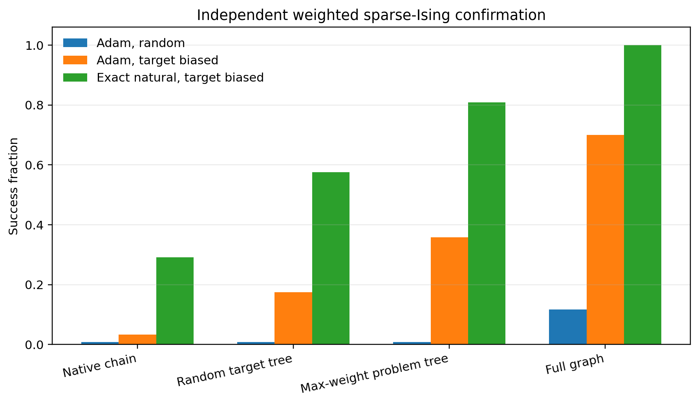

# Representation Alignment in Commuting Quantum Boltzmann Machines

[](https://github.com/GoGoKo699/QBM-Representation-Alignment/actions/workflows/tests.yml)
[](https://github.com/GoGoKo699/QBM-Representation-Alignment/releases/tag/v1.1.0)
[](LICENSE)
[](pyproject.toml)
[](CITATION.md)

**Reader routes:** [confirmed result](#confirmed-result) · [claim-to-evidence map](docs/evidence_map.md) · [scope and nonclaims](docs/scientific_claims.md) · [research context](docs/research_context.md) · [reproduce](docs/reproducibility.md) · [release notes](CHANGELOG.md) · [cite](CITATION.md)

This repository studies a concrete ansatz-design question:

> How should the interaction graph of a commuting quantum Boltzmann machine be chosen when both finite-budget trainability and exact Gibbs/q-sample preparation matter?

The central result comes from a prospectively frozen confirmation on 24 separately generated weighted sparse-Ising targets. The protocol, instance-seed commitment, graph rules, endpoints, and decision thresholds were fixed before that target ensemble was generated. This is an internal confirmation on unseen targets, not an external replication by another group.

At the same treewidth, interaction count, and parameter count, a target-supported spanning-tree representation trains substantially better than a generic chain. Selecting the tree by maximum absolute target-coupling weight improves further over a prespecified random target-supported tree. The full target graph remains the trainability ceiling, but requires a larger exact conditional-rotation description.

The work concerns a commuting, classically tractable sector of quantum Boltzmann machines. It provides exact geometry, controlled optimization evidence, and explicit q-sample preparation resources. It does **not** claim quantum speedup.



## Confirmed result

The prospectively frozen experiment uses:

```text
instances:              24 connected weighted 3-regular Ising targets
variables:              n = 16
parameter seeds:        0, 19, 42, 50, 101
recorded states:        200 per trajectory
confirmatory runs:      1,440
```

Success is defined by

$$
\frac{E-E_0}{\gamma}\le 0.1,
$$

where $\gamma$ is the spectral gap. Every target has one exact ground state, so this threshold certifies ground-state probability $p_\star\ge 0.9$.

| Optimizer and initialization | Native chain | Random target tree | Max-weight target tree | Full graph |
|---|---:|---:|---:|---:|
| Adam, random | 0.83% | 0.83% | 0.83% | 11.67% |
| Adam, target biased | 3.33% | 17.50% | **35.83%** | 70.00% |
| Exact-natural oracle, target biased | 29.17% | 57.50% | **80.83%** | 100.00% |

The three prespecified paired effects are:

| Comparison | Difference | Multiplicity-adjusted interval |
|---|---:|---:|
| Max-weight tree minus chain, target-biased Adam | **+32.50 points** | `[+15.83, +50.83]` |
| Max-weight tree minus random target tree, target-biased Adam | **+18.33 points** | `[+6.67, +31.67]` |
| Max-weight tree minus chain, exact natural gradient | **+51.67 points** | `[+35.00, +66.67]` |

Here, **target biased** means $\theta^{(0)}=c_G+0.3\xi$, with one matched all-pairs Gaussian vector restricted to each representation. The **exact-natural oracle** uses the exact Fisher pseudoinverse and exact Armijo energy evaluation; it is a geometric ceiling, not a practical sampled-cost claim.

The chain and both trees have:

```text
treewidth:           1
pair terms:          15
parameters:          31
conditional angles:  31
CNOT upper count:    30
```

The full target graphs have treewidth between 3 and 5 and require 75–159 conditional angles, with median 131.

In source code and CSV files, `problem_tree` denotes the deterministic target-supported spanning tree obtained by maximizing edge weight $|J|$, abbreviated `MAXJ` in the documentation.

- [Primary effects](results/confirmatory/primary_effects.csv)
- [Aggregate outcomes](results/confirmatory/aggregate.csv)
- [Preparation resources](results/confirmatory/preparation_resources.csv)
- [Scientific validation](results/confirmatory/validation.json)
- [Experiment protocol](experiments/sparse_ising_confirmation/protocol/protocol.md)
- [Statistical analysis](docs/statistical_analysis.md)
- [Claim-to-evidence map](docs/evidence_map.md)

## Later graph-selection boundary study

An exhaustive supporting study asks whether a temperature-dependent tree chosen by retained target-state cooling power can improve upon the fixed maximum-weight heuristic. The geometry does reorder strongly, but the operational test fails: at the certification temperature, the cooling-power-optimal tree has a worse projected target-energy gap than both the best hot-optimal tree and the forward-KL-optimal tree on all ten reused development instances.

The study therefore records a boundary rather than extending the primary claim:

> Retained target-state cooling power is not validated as an operational tree-selection objective on the tested corpus.

See [temperature-dependent tree geometry](studies/temperature_tree_geometry/README.md). This later study does not modify the frozen primary comparison or the confirmed `MAXJ` benchmark result.

## How to cite

GitHub reads [`CITATION.cff`](CITATION.cff) and exposes a **Cite this repository** control on the repository page. Copy-ready citation text and BibTeX are also provided in [`CITATION.md`](CITATION.md).

> Lin, R. (2026). *Representation Alignment in Commuting Quantum Boltzmann Machines* (Version 1.1.0) [Computer software]. GitHub. https://github.com/GoGoKo699/QBM-Representation-Alignment

For the complete archive, cite the published [`v1.1.0`](https://github.com/GoGoKo699/QBM-Representation-Alignment/releases/tag/v1.1.0) release. For the primary confirmed `MAXJ` result in its original release state, cite [`v1.0.0`](https://github.com/GoGoKo699/QBM-Representation-Alignment/releases/tag/v1.0.0). See [`CITATION.md`](CITATION.md) for copy-ready formats and exact-result guidance.

## Geometry

For a Gibbs family

$$
p_\theta(z)=\frac{e^{-\theta^{\mathsf{T}}F_G(z)}}{Z(\theta)}
$$

and a target decomposed as

$$
C(z)=c_0+c_G^{\mathsf{T}}F_G(z)+R_G(z),
$$

the exact energy gradient is

$$
\nabla E(\theta)=-I_G(\theta)c_G-r_G(\theta),
$$

where

$$
I_G=\mathrm{Cov}(F_G,F_G),
\qquad
r_G=\mathrm{Cov}(F_G,R_G).
$$

Full alignment gives $R_G=0$, so the Fisher natural-gradient direction is the target coefficient direction. Partial representations retain a state-dependent omitted-cost covariance term. This explains why representations with the same width and number of parameters can have different trainability.

See [theory](docs/theory.md). For established prior work, the classical tree-approximation comparison, and the novelty boundary, see [research context](docs/research_context.md).

## Repository structure

```text
src/qbm_alignment/                         shared implementation
experiments/sparse_ising_confirmation/     prospectively frozen primary experiment
studies/boundary_geometry/                 same-state optimizer replay
studies/finite_sample_geometry/            sampled covariance geometry
studies/partial_alignment_geometry/        partial-representation study
studies/temperature_tree_geometry/         exhaustive graph-selection boundary study
data/certificate_tight_instances/          shared development instances
results/                                   canonical compact result tables
figures/                                   main public figures
docs/                                      theory, preparation, formats, limits
tests/                                     fast regression and identity tests
```

The supporting studies are not additional primary claims. They document mechanisms, estimator behavior, and tested boundaries that motivated or contextualize the prospectively frozen confirmation.

## Installation

Python 3.10 or newer is recommended.

```bash
python -m venv .venv
source .venv/bin/activate
python -m pip install --upgrade pip
python -m pip install -e ".[test]"
```

## Validate the packaged results

Fast validation:

```bash
python scripts/validate_repository.py
python -m pytest -q
```

Complete packaged-release validation:

```bash
make release-check
```

The packaged-release command checks compilation, tests, local links, release metadata, packaged PASS records, and wheel construction. Recompute all scientific validation records with `make validate-all`, or run the primary validation directly with:

```bash
python experiments/sparse_ising_confirmation/scripts/validate_experiment.py
```

Each supporting study also provides its own `scripts/validate_study.py`.

## Regenerate compact tables and figures

Regenerate the primary confirmatory analysis:

```bash
bash scripts/refresh_analysis.sh
```

Supporting studies can be regenerated individually or together:

```bash
bash scripts/refresh_analysis.sh boundary
bash scripts/refresh_analysis.sh finite
bash scripts/refresh_analysis.sh partial
bash scripts/refresh_analysis.sh temperature
bash scripts/refresh_analysis.sh all
```

These commands use packaged data. Re-running the optimization trajectories or the exhaustive tree-temperature calculation is more expensive and is documented separately in [reproducibility](docs/reproducibility.md).

## Supporting studies

- [Excited-boundary optimizer geometry](studies/boundary_geometry/README.md)
- [Finite-sample geometry](studies/finite_sample_geometry/README.md)
- [Partial-alignment geometry](studies/partial_alignment_geometry/README.md)
- [Temperature-dependent tree geometry](studies/temperature_tree_geometry/README.md)

## Interpretation limits

The repository does not establish:

- quantum advantage;
- favorable asymptotic scaling;
- a standard barren plateau;
- universal optimality of maximum-weight spanning trees;
- a validated cooling-power-based adaptive tree selector;
- hardware-efficient Gibbs-state preparation;
- universal superiority of natural gradient;
- frequent excited-boundary traps on arbitrary Ising ensembles.

See [limitations](docs/limitations.md).

## Citation, reuse, and contributions

Use [`CITATION.md`](CITATION.md) or GitHub's **Cite this repository** control for copy-ready citation formats; machine-readable metadata are in [`CITATION.cff`](CITATION.cff). Code, data, figures, and documentation are released under the [BSD 3-Clause License](LICENSE). Bug reports, reproducibility questions, and focused contributions are welcome; see [`CONTRIBUTING.md`](CONTRIBUTING.md).
